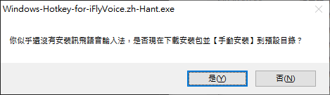

 [](https://www.gnu.org/licenses/gpl-3.0)  

# Windows-Hotkey-for-iFlyVoice 

An [AutoHotKey](https://www.autohotkey.com/) script to configure <kbd>Win</kbd>+<kbd>H</kbd> as the custom Hotkey for quick start of the **iFLYTEK Voice Input** Floating Window (讯飞语音悬浮窗).

<p align="center">
  
</p>

## 🔣 中文版網站

<https://medium.com/agile-win-hotkey-for-iflyvoice>

<br>

## 🚀 Usages

- Change the hotkey for [Windows 10 voice recognition](https://support.microsoft.com/en-us/windows/use-voice-recognition-in-windows-10-83ff75bd-63eb-0b6c-18d4-6fae94050571) from <kbd>Win</kbd>+<kbd>H</kbd> to <kbd>Win</kbd>+<kbd>Alt</kbd>+<kbd>H</kbd>
- Override <kbd>Win</kbd>+<kbd>H</kbd> hotkey and trigger iFLYTEK Voice Input in the following conditions:

  - Launch **iFLYTEK Voice Input** if the program is not running in the background.

    

  - **Start/stop listening** if the Floating Window is on the desktop.

    

  - Ask to download the installation package and install it to the default directory if [iFlyIME (讯飞输入法) v3.0.1746](https://srf.xunfei.cn/) does not exist on your computer.

    

## ⚙️ Configuration (Optional)

You can customize the script's behavior by creating a `config.ini` file in `%APPDATA%\Agile-Win-Hotkey-for-iFlyVoice\`. This folder is typically located at `C:\Users\<Your Username>\AppData\Roaming\Agile-Win-Hotkey-for-iFlyVoice\`.

Here are the available options:

```ini
[Preference]
iFlyIME_Path = C:\path\to\your\iFlyVoice.exe
Langauge = en-US
```

- **`iFlyIME_Path`**: Set a custom path for `iFlyVoice.exe`. If not specified, the script will look for it in the default installation directory (`C:\Program Files (x86)\iFlytek\iFlyIME\3.0.1746\`).

- **`Langauge`**: Change the display language for messages and the tray menu. Supported languages are:
  - `en-US` (English - default)
  - `zh-CN` (Simplified Chinese)
  - `zh-TW` (Traditional Chinese)

## ✅ Requirements

- **Operation System**: Windows Only
- **Software**: iFlyIME (讯飞输入法) for Windows v3.0.1746

## 🧪 Tested applications

    ✅ Microsoft Word
    ✅ Microsoft Excel
    ✅ Microsoft OneNote
    ✅ Notion for Windows
    ✅ OneNote for Windows 10
    ✅ Visual Studio Code
    ✅ WhatsApp Desktop

## 🔽 Download

[](https://github.com/chriskyfung/Agile-Win-Hotkey-for-iFlyVoice/releases)

* * *

## Like my stuff?

> Would you like to buy me a coffee? I would really appreciate it if you could support me for the app development.
>
> <a href="https://www.buymeacoffee.com/chrisfungky"></a>

## Contributing

> Pull requests for new features, bug fixes, and suggestions are welcome!

## License

> Distributed under the [GNU General Public License v3.0](LICENSE)
