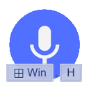

# Agile-Win-Hotkey-for-iFlyVoice 

<p align="center">
  <a href="README.md" title="English README">
    
  </a>
  <a href="README.zh-CN.md" title="简体中文 README">
    
  </a>
  <a href="README.zh-TW.md" title="繁體中文 README">
    
  </a>
</p>
<p align="center">
  <a href="https://support.microsoft.com/windows/use-voice-typing-to-talk-instead-of-type-on-your-pc-fec94565-c4bd-329d-e59a-af033fa5689f" title="Visit Microsoft Support">
    
  </a>
  <a href="https://github.com/chriskyfung/Agile-Win-Hotkey-for-iFlyVoice/releases/latest/">
    
  </a>
  <a href="https://github.com/chriskyfung/Agile-Win-Hotkey-for-iFlyVoice/releases">
    
  </a>
  <a href="https://www.gnu.org/licenses/gpl-3.0">
    
  </a>
</p>

<p align="center">
  
</p>

Elevate your dictation experience on Windows with **Agile-Win-Hotkey-for-iFlyVoice**. This [AutoHotkey v2](https://www.autohotkey.com/) script intelligently reconfigures the <kbd>Win</kbd>+<kbd>H</kbd> hotkey, transforming it into a powerful shortcut for seamless control of the **iFLYTEK Voice Input** Floating Window (讯飞语音悬浮窗).

<p align="center">
  <a href="https://chriskyfung.github.io/Agile-Win-Hotkey-for-iFlyVoice/" title="GitHub Pages">
    
  </a>
  <a href="https://medium.com/agile-win-hotkey-for-iflyvoice" title="Go to Medium">
    
  </a>
</p>

<p align="center">
  <a href="https://github.com/sponsors/chriskyfung" title="Sponsor on GitHub">
    
  </a>
  <a href="https://www.buymeacoffee.com/chriskyfung" title="Support Coffee">
    
  </a>
</p>

## ✨ Key Features

### ⌨ Intelligent Hotkey Management

- The default <kbd>Win</kbd>+<kbd>H</kbd> hotkey for Windows voice recognition is remapped to <kbd>Win</kbd>+<kbd>Alt</kbd>+<kbd>H</kbd>, freeing up the primary shortcut.
- Pressing <kbd>Win</kbd>+<kbd>H</kbd> now intelligently controls iFLYTEK Voice Input:
  - **Launch**: If iFLYTEK Voice Input is not running, it will be automatically launched.
    
  - **Toggle Listening**: If the iFLYTEK Floating Window is already active, <kbd>Win</kbd>+<kbd>H</kbd> will instantly toggle its listening state (start/stop dictation).  
    

### ⬇ Seamless Installation & Dependency Management

- If iFlyIME (讯飞输入法) is not detected on your system, our utility will intelligently prompt you to download and install the official package directly from [https://srf.xunfei.cn/](https://srf.xunfei.cn/).

  

- Monitor the download process with a clear progress bar, ensuring a smooth and transparent installation experience.
  
  

## ⚙️ Configuration (Optional)

Tailor the script's behavior to your preferences by creating a `config.ini` file. Place this file in `%APPDATA%\Agile-Win-Hotkey-for-iFlyVoice\` (typically `C:\Users\<Your Username>\AppData\Roaming\Agile-Win-Hotkey-for-iFlyVoice\`).

Here are the available customization options:

```ini
[Preference]
iFlyIME_Path = C:\path\to\your\iFlyVoice.exe
Langauge = en-US
```

- **`iFlyIME_Path`**: Set a custom path for `iFlyVoice.exe`. If not specified, the script will look for it in the default installation directory (`C:\Program Files (x86)\iFlytek\iFlyIME\3.0.1746\`).

- **`Langauge`**: Change the display language for messages and the tray menu. Supported languages are:
  - `en-US` (English - default)
  - `zh-CN` (Simplified Chinese)
  - `zh-TW` (Traditional Chinese)

## ✅ Requirements

- **AutoHotkey**: [AutoHotkey v2](https://www.autohotkey.com/download/) (for running from source)
- **Operating System**: Windows
- **Software**: iFlyIME (讯飞输入法) for Windows v3.0.1746

## 🧪 Tested applications

    ✅ Microsoft Word
    ✅ Microsoft Excel
    ✅ Microsoft OneNote
    ✅ Notion for Windows
    ✅ OneNote for Windows 10
    ✅ Visual Studio Code
    ✅ WhatsApp Desktop

## 💗 Like My Stuff?

> Would you like to buy me a coffee? I would really appreciate it if you could support me for the app development.
>
> <a href="https://www.buymeacoffee.com/chrisfungky"></a>

## 🤝 Contributing

> Pull requests for new features, bug fixes, and suggestions are welcome! Please refer to our [CONTRIBUTING.md](CONTRIBUTING.md) for more details.

## 📄 License

> Distributed under the [GNU General Public License v3.0](LICENSE)
