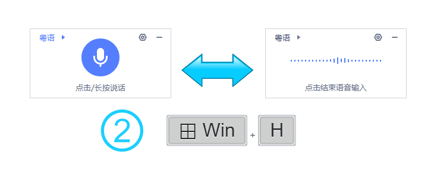

    

# English Website for Agile-Win-Hotkey-for-iFlyVoice

# Windows-Hotkey-for-iFlyVoice 

An [AutoHotKey](https://www.autohotkey.com/) script to configure <kbd>Win</kbd>+<kbd>H</kbd> as the custom Hotkey for quick start of the **iFLYTEK Voice Input** Floating Window (讯飞语音悬浮窗).

- ## [Windows-Hotkey-for-iFlyVoice](https://github.com/chriskyfung/Agile-Win-Hotkey-for-iFlyVoice/tree/main/Windows-Hotkey-for-iFlyVoice)

    

    

## Like my stuff?

> Would you like to buy me a coffee? I would really appreciate it if you could support me for the app development.
>
> 

## Contributing

> Pull requests for new features, bug fixes, and suggestions are welcome!

## License

> Distributed under the [GNU General Public License v3.0](LICENSE)