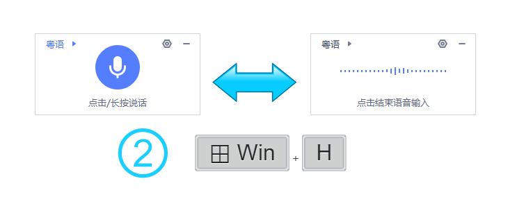
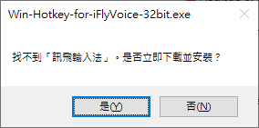
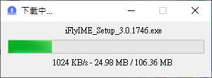

# Agile-Win-Hotkey-for-iFlyVoice (简体中文) 

<p align="center">
  <a href="README.md" title="英文 README">
    
  </a>
  <a href="README.zh-CN.md" title="简体中文 README">
    
  </a>
  <a href="README.zh-TW.md" title="繁體中文 README">
    
  </a>
</p>
<p align="center">
  <a href="https://support.microsoft.com/windows/use-voice-typing-to-talk-instead-of-type-on-your-pc-fec94565-c4bd-329d-e59a-af033fa5689f" title="访问 Microsoft 支持">
    
  </a>
  <a href="https://github.com/chriskyfung/Agile-Win-Hotkey-for-iFlyVoice/releases/latest/">
    
  </a>
  <a href="https://github.com/chriskyfung/Agile-Win-Hotkey-for-iFlyVoice/releases">
    
  </a>
  <a href="https://www.gnu.org/licenses/gpl-3.0">
    
  </a>
</p>

<p align="center">
  
</p>

使用 **Agile-Win-Hotkey-for-iFlyVoice** 提升您在 Windows 上的听写体验。这个 [AutoHotkey v2](https://www.autohotkey.com/) 脚本智能地重新配置了 <kbd>Win</kbd>+<kbd>H</kbd> 热键，将其转换为一个强大的快捷方式，用于无缝控制 **iFLYTEK 语音输入** 悬浮窗 (讯飞语音悬浮窗)。

<p align="center">
  <a href="https://chriskyfung.github.io/Agile-Win-Hotkey-for-iFlyVoice/" title="GitHub Pages">
    
  </a>
  <a href="https://medium.com/agile-win-hotkey-for-iflyvoice" title="前往 Medium">
    
  </a>
</p>

<p align="center">
  <a href="https://github.com/sponsors/chriskyfung" title="在 GitHub 上赞助">
    
  </a>
  <a href="https://www.buymeacoffee.com/chriskyfung" title="支持咖啡">
    
  </a>
</p>

## ✨ 主要功能

### ⌨ 智能热键管理

- Windows 语音识别的默认 <kbd>Win</kbd>+<kbd>H</kbd> 热键被重新映射到 <kbd>Win</kbd>+<kbd>Alt</kbd>+<kbd>H</kbd>，从而释放了主要快捷方式。
- 现在按下 <kbd>Win</kbd>+<kbd>H</kbd> 可以智能控制 iFLYTEK 语音输入：
  - **启动**：如果 iFLYTEK 语音输入未运行，它将自动启动。
    
  - **切换监听**：如果 iFLYTEK 悬浮窗已激活，<kbd>Win</kbd>+<kbd>H</kbd> 将立即切换其监听状态（开始/停止听写）。
    

### ⬇ 无缝安装和依赖管理

- 如果您的系统未检测到 iFlyIME (讯飞输入法)，我们的实用程序将智能提示您直接从 [https://srf.xunfei.cn/](https://srf.xunfei.cn/) 下载并安装官方软件包。

  

- 通过清晰的进度条监控下载过程，确保流畅透明的安装体验。
  
  

## ⚙️ 配置 (可选)

通过创建 `config.ini` 文件，根据您的偏好调整脚本行为。将此文件放置在 `%APPDATA%\Agile-Win-Hotkey-for-iFlyVoice\` (通常是 `C:\Users\<您的用户名>\AppData\Roaming\Agile-Win-Hotkey-for-iFlyVoice\`)。

以下是可用的自定义选项：

```ini
[Preference]
iFlyIME_Path = C:\path\to\your\iFlyVoice.exe
Langauge = en-US
```

- **`iFlyIME_Path`**：为 `iFlyVoice.exe` 设置自定义路径。如果未指定，脚本将在默认安装目录 (`C:\Program Files (x86)\iFlytek\iFlyIME\3.0.1746\`) 中查找。

- **`Langauge`**：更改消息和托盘菜单的显示语言。支持的语言有：
  - `en-US` (英语 - 默认)
  - `zh-CN` (简体中文)
  - `zh-TW` (繁体中文)

## ✅ 要求

- **AutoHotkey**：AutoHotkey v2 (用于从源代码运行)
- **操作系统**：Windows
- **软件**：iFlyIME (讯飞输入法) for Windows v3.0.1746

## 🧪 已测试应用程序

    ✅ Microsoft Word
    ✅ Microsoft Excel
    ✅ Microsoft OneNote
    ✅ Notion for Windows
    ✅ OneNote for Windows 10
    ✅ Visual Studio Code
    ✅ WhatsApp Desktop

## 💗 喜欢我的作品吗？

> 您愿意请我喝杯咖啡吗？如果您能支持我的应用程序开发，我将不胜感激。
>
> <a href="https://www.buymeacoffee.com/chrisfungky"></a>

## 🤝 贡献

> 欢迎提交新功能、错误修复和建议的拉取请求！请参阅我们的 CONTRIBUTING.md 了解更多详情。

## 📄 许可证

> 根据 GNU General Public License v3.0 发布
