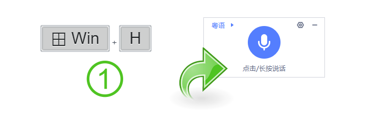

# Agile-Win-Hotkey-for-iFlyVoice (繁體中文) 

<p align="center">
  <a href="README.md" title="英文 README">
    
  </a>
  <a href="README.zh-CN.md" title="简体中文 README">
    
  </a>
  <a href="README.zh-TW.md" title="繁體中文 README">
    
  </a>
</p>
<p align="center">
  <a href="https://support.microsoft.com/windows/use-voice-typing-to-talk-instead-of-type-on-your-pc-fec94565-c4bd-329d-e59a-af033fa5689f" title="造訪 Microsoft 支援">
    
  </a>
  <a href="https://github.com/chriskyfung/Agile-Win-Hotkey-for-iFlyVoice/releases/latest/">
    
  </a>
  <a href="https://github.com/chriskyfung/Agile-Win-Hotkey-for-iFlyVoice/releases">
    
  </a>
  <a href="https://www.gnu.org/licenses/gpl-3.0">
    
  </a>
</p>

<p align="center">
  
</p>

使用 **Agile-Win-Hotkey-for-iFlyVoice** 提升您在 Windows 上的聽寫體驗。這個 [AutoHotkey v2](https://www.autohotkey.com/) 腳本智能地重新配置了 <kbd>Win</kbd>+<kbd>H</kbd> 熱鍵，將其轉換為一個強大的快捷方式，用於無縫控制 **iFLYTEK 語音輸入** 懸浮窗 (訊飛語音懸浮窗)。

<p align="center">
  <a href="https://chriskyfung.github.io/Agile-Win-Hotkey-for-iFlyVoice/" title="GitHub Pages">
    
  </a>
  <a href="https://medium.com/agile-win-hotkey-for-iflyvoice" title="前往 Medium">
    
  </a>
</p>

<p align="center">
  <a href="https://github.com/sponsors/chriskyfung" title="在 GitHub 上贊助">
    
  </a>
  <a href="https://www.buymeacoffee.com/chriskyfung" title="支持咖啡">
    
  </a>
</p>

## ✨ 主要功能

### ⌨ 智能熱鍵管理

- Windows 語音識別的預設 <kbd>Win</kbd>+<kbd>H</kbd> 熱鍵被重新映射到 <kbd>Win</kbd>+<kbd>Alt</kbd>+<kbd>H</kbd>，從而釋放了主要快捷方式。
- 現在按下 <kbd>Win</kbd>+<kbd>H</kbd> 可以智能控制 iFLYTEK 語音輸入：
  - **啟動**：如果 iFLYTEK 語音輸入未運行，它將自動啟動。
    
  - **切換監聽**：如果 iFLYTEK 懸浮窗已激活，<kbd>Win</kbd>+<kbd>H</kbd> 將立即切換其監聽狀態（開始/停止聽寫）。
    

### ⬇ 無縫安裝和依賴管理

- 如果您的系統未檢測到 iFlyIME (訊飛輸入法)，我們的實用程序將智能提示您直接從 [https://srf.xunfei.cn/](https://srf.xunfei.cn/) 下載並安裝官方軟體包。

  

- 透過清晰的進度條監控下載過程，確保流暢透明的安裝體驗。
  
  

## ⚙️ 配置 (可選)

透過創建 `config.ini` 文件，根據您的偏好調整腳本行為。將此文件放置在 `%APPDATA%\Agile-Win-Hotkey-for-iFlyVoice\` (通常是 `C:\Users\<您的用戶名>\AppData\Roaming\Agile-Win-Hotkey-for-iFlyVoice\`)。

以下是可用的自定義選項：

```ini
[Preference]
iFlyIME_Path = C:\path\to\your\iFlyVoice.exe
Langauge = en-US
```

- **`iFlyIME_Path`**：為 `iFlyVoice.exe` 設定自定義路徑。如果未指定，腳本將在預設安裝目錄 (`C:\Program Files (x86)\iFlytek\iFlyIME\3.0.1746\`) 中查找。

- **`Langauge`**：更改消息和托盤菜單的顯示語言。支援的語言有：
  - `en-US` (英語 - 預設)
  - `zh-CN` (簡體中文)
  - `zh-TW` (繁體中文)

## ✅ 要求

- **AutoHotkey**：AutoHotkey v2 (用於從原始碼運行)
- **操作系統**：Windows
- **軟體**：iFlyIME (訊飛輸入法) for Windows v3.0.1746

## 🧪 已測試應用程式

    ✅ Microsoft Word
    ✅ Microsoft Excel
    ✅ Microsoft OneNote
    ✅ Notion for Windows
    ✅ OneNote for Windows 10
    ✅ Visual Studio Code
    ✅ WhatsApp Desktop

## 💗 喜歡我的作品嗎？

> 您願意請我喝杯咖啡嗎？如果您能支持我的應用程式開發，我將不勝感激。
>
> <a href="https://www.buymeacoffee.com/chrisfungky"></a>

## 🤝 貢獻

> 歡迎提交新功能、錯誤修復和建議的拉取請求！請參閱我們的 CONTRIBUTING.md 了解更多詳情。

## 📄 授權

> 根據 GNU General Public License v3.0 發布
